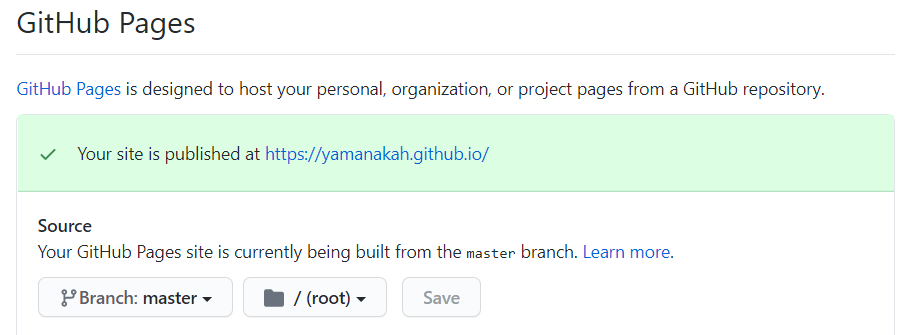

>This post is a work in progress! 

Here is a quick guide on how to set up a website or personal blog with GitHub pages and Jekyll. Both platforms are completely free of any cost, perform very well and can be foundations for great looking sites.

## Jekyll installation

Note that Windows is not an officially supported platform for Jekyll. Nevertheless it can be run just fine by following the steps below. The easiest way is using the RubyInstaller for Windows. It provides the Ruby language and execution environment, which Jekyll runs on.

1. Download the recommended version of the rubyinstaller-devkit 
[RubyInstaller Download]("paste link here")
2. Install the Ruby base files and MSYS2 development toolchain
3. Run the "ridk install" step on the last page of the installation wizard
4. In a new command prompt window run: "gem install jekyll bundler"

## GitHub page repository

Next, you want to create a GitHub repository for the website. Use your username plus .github.io as the repository name. This will also be the webpage address.

>Note: If you name the repository anything other than username.github.io it will still work as a GitHub page, but the address will be username.github.io/repository_name.

Once the empty repository is created go to the repository settings and scroll down to the GitHub Pages section. Here you need to set the source as branch: master in your root folder.

Now you are all set to create the webpage.

## Create Jekyll site

Clone your new GitHub repository on your local environment.
>git clone https://github.com/repository_name

Go to the repository (current directory needs to be the cloned repository location) and create a new Jekyll project by running the following command
> jekyll new . --force

This will create a number of folders and files inside the repository. These are the puzzle pieces that will create your webpage. At this stage the Jekyll site is already set up to be explored and edited. By default it has the minima theme set up, which is a beautiful simplistic layout.

### Running the site locally
To get the page running locally you first need to install the necessary Jekyll bundles by running:
>install bundles

Now the website can be run locally in order for you to look at the content via your browser. Just type
> bundle exec jekyll serve

Once the command executes it will offer a link in the terminal output. Click that link and it will open in your  browser displaying the locally hosted webpage. Easy!

Press Ctrl+C inside the terminal to stop the process. Any changes to the website will be visible when reloading the browser. 

For a continuous live feed of the latest website state add --livereload to the command above:
> bundle exec jekyll serve --livereload

### Getting the GitHub page online
Once the Jekyll site has been created on the local cloned repository it only needs to be uploaded to GitHub. Just commit the changes made locally and sync the repository with GitHub. In VisualStudio Code you can press CRTL+Shift+P and type
>Git: Commit
and then
>Git: Sync

## Troubleshooting
### Making livereload work under Windows
Sometimes the livereload functionality does not work under Windows. To resolve the issue you need to re-install the eventmachine gem. In order to do so, run the following two commands:
>gem uninstall eventmachine --force
>gem install eventmachine --platform ruby

-----
Sources:
jekyllrb.com
github.com